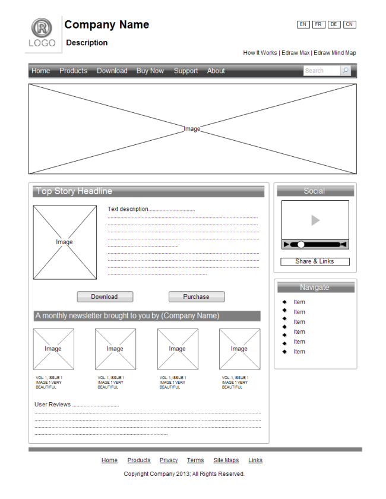
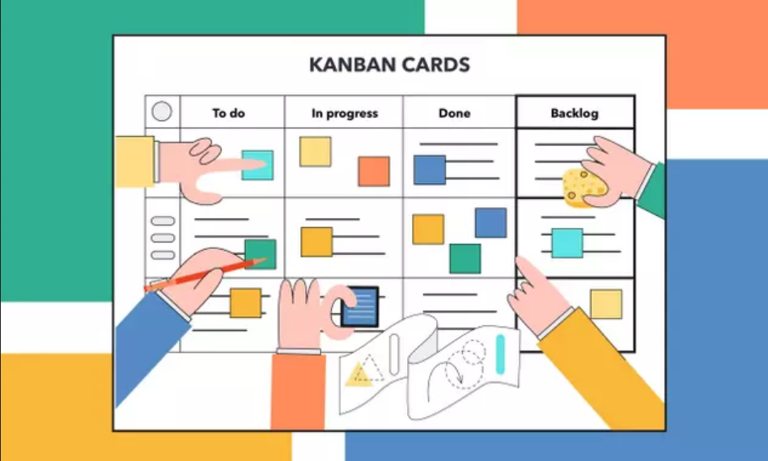

# adapeco-worflow
Réaliser un site web...avant de réaliser un site web

- Identification du besoin
    - Faire préciser le sujet du site et le délais pour le réaliser.
    - Faire réaliser le cahier des charges ou le réaliser soi même au besoin.
    - Faire valider et, à minima, avoir une trace écrite de de validat

- Réaliser le wireframe
    - Soit à la main, si c’est pour soi même, soit avec un logiciel pour présenter au client.
    - Réaliser le plan du site, à minima de manière textuel, c’est à dire avec les titres des pages.
    - Faire valider et, à minima, avoir une trace écrite de de validation.
        
          

- Réaliser la maquette
    - Faire une feuille de style reprenant les codes couleurs et la/les police(s) de caractères dans ses différents état.
    - Réaliser une maquette, static ou dynamique selon le besoin et le temps imparti.
    - Réaliser le plan du site maquetter.
    - Faire valider et, à minima, avoir une trace écrite de de validation.

 - Réaliser le backlog
    - Utiliser la méthode «kanban » avec l’outil Git Project ou Trello. 
    - Pour chaque fonctionnalité, préciser : 
    - l’utilisateur concerné
    - le cas d’utilisation, sur le modèle « En tant que utilisateur/administrateur, je veux … »
    - une date de fin
            
            
 
